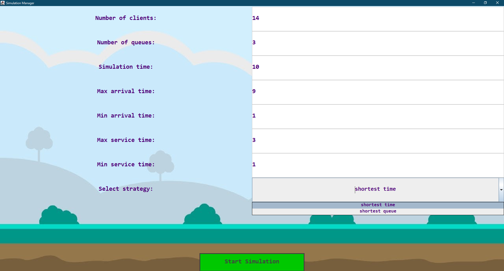
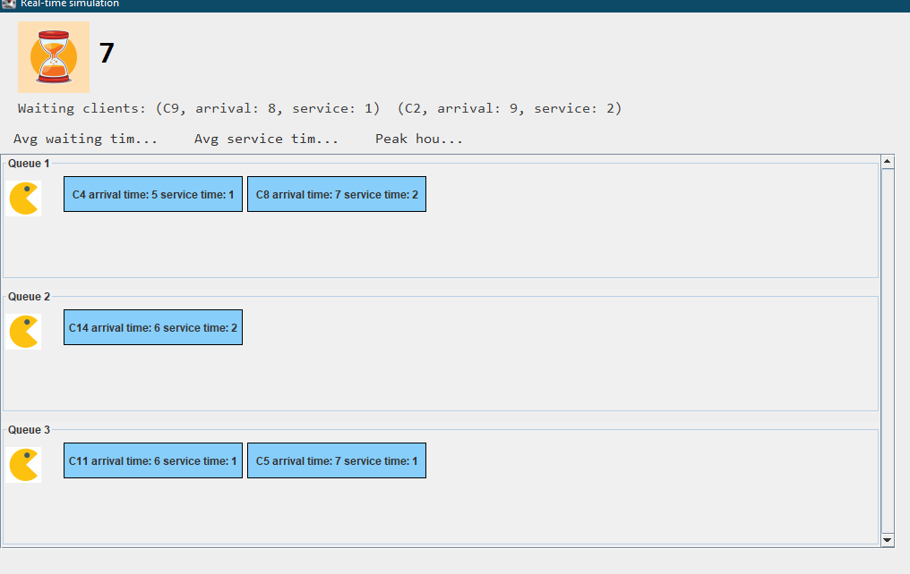

🕹️ Service Queue Simulator
Welcome to the Service Queue Simulator! This is a dynamic, multithreaded Java application designed to simulate and analyze client queuing systems in real-time. Complete with a fun, custom Pacman-themed GUI, this project visually demonstrates how different routing strategies impact waiting times, service efficiency, and queue lengths.

📖 Project Overview
Managing queues efficiently is a classic computer science problem. This simulator allows users to configure a theoretical environment—defining the number of queues, clients, and time constraints—and then watch the simulation unfold live.

Behind the scenes, the application leverages robust Java Multithreading. Each queue operates on its own dedicated thread, processing clients asynchronously while a master thread dispatches incoming clients based on your chosen algorithmic strategy.

✨ Key Features
Multithreaded Architecture: True concurrent processing where each queue acts as an independent thread serving clients.

Algorithmic Strategies: Choose between two distinct dispatching strategies (implementing the Strategy Design Pattern):

⏱️ Shortest Time: Routes the new client to the queue with the lowest total remaining service time.

🧍 Shortest Queue: Routes the new client to the queue currently holding the fewest number of people.

Pacman Visual UI: A highly customized, retro-styled interface where "Pacman" servers consume client tasks in real-time.

Live Statistics: Tracks and dynamically updates critical metrics during the run:

Average Waiting Time

Average Service Time

Peak Hour (the moment with the highest simultaneous workload)

Customizable Parameters: Full control over simulation variables, including min/max arrival times, min/max service times, simulation duration, and the total number of clients/queues.

📸 Screenshots
Here is a look at the simulator in action:

Above: The Setup Manager where users configure the simulation variables and select the dispatching strategy.

Above: The real-time Pacman UI tracking the queues, waiting clients, and live statistics.

💻 Technical Details
Language: Java

Concurrency: Uses Thread, Runnable, and synchronization techniques (like BlockingQueue or Atomic variables) to prevent race conditions during client dispatching.

Design Patterns: Utilizes the Strategy Pattern for seamless switching between the "Shortest Time" and "Shortest Queue" algorithms.

UI Framework: Java Swing / AWT (Custom painted components).

🚀 Getting Started
Prerequisites
Java Development Kit (JDK): Version 8 or higher is required to run the application.

Your favorite Java IDE (IntelliJ IDEA, Eclipse, etc.).

Installation & Execution

Clone the repository:
git clone https://github.com/Adelinn77/Service-Queue-Simulator.git

Open the project:
Import the cloned repository into your IDE.

Run the Application:
Locate the main class (usually named Main or SimulationManager) and run it.

Configure:
Enter your desired parameters in the startup UI, pick your strategy, and click Start Simulation to watch the Pacmans get to work!

Author: Adelinn77

A multithreaded exploration of queue management algorithms. 👻🍒
